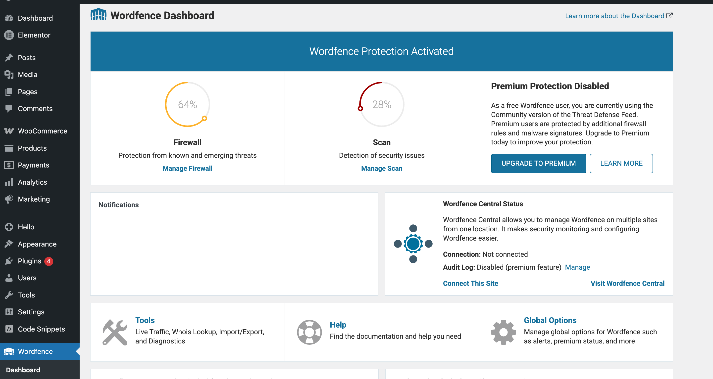
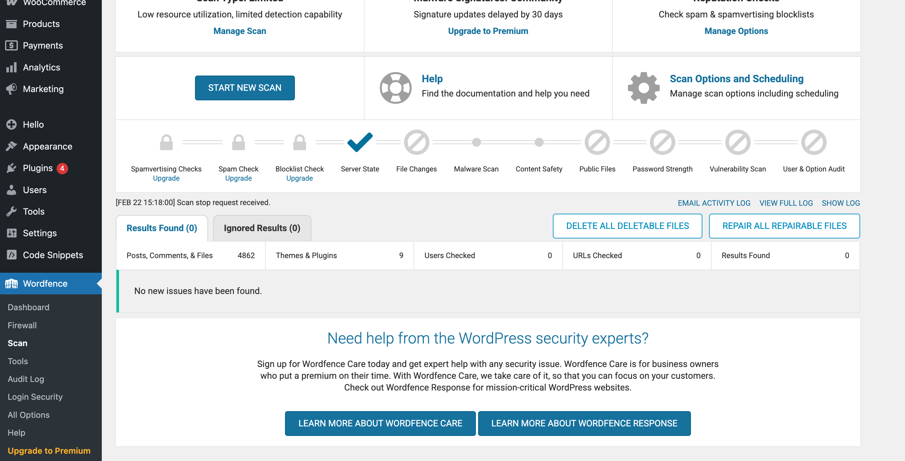
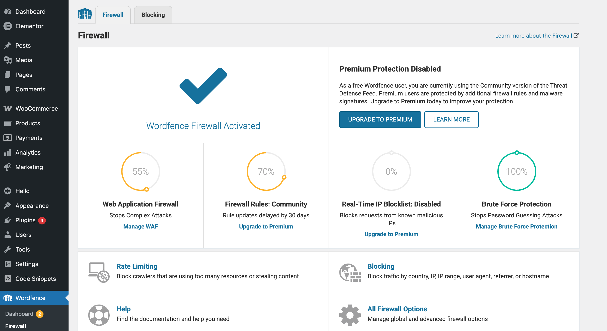
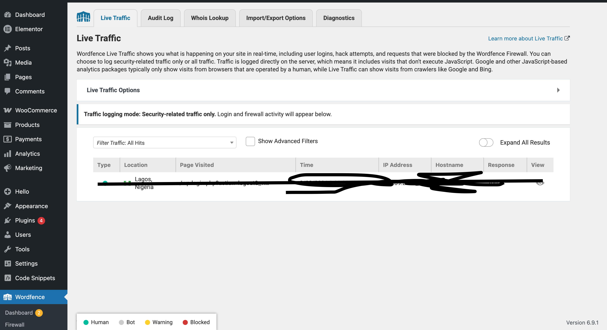
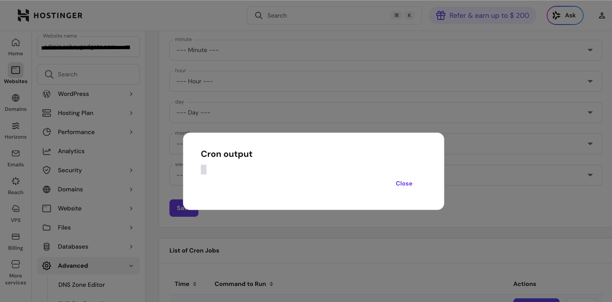

WordPress Security Hardening & Maintenance Case Study

This repository documents the security hardening and maintenance work performed on a production WordPress WooCommerce website.

The goal of this documentation is to demonstrate real-world troubleshooting, security configuration, and operational maintenance of a deployed web application.

Environment
	•	Platform: WordPress (WooCommerce store)
	•	Hosting: Shared hosting (subdomain deployment)
	•	Security Tool: Wordfence Security Plugin
	•	SSL: Enabled (HTTPS enforced)

The website was deployed on a subdomain with low visitor traffic.

Initial Problem

After installing Wordfence, the malware scan repeatedly failed.

Observed behavior:
	•	Scan started normally
	•	Thousands of files were indexed
	•	Scan terminated before completion
	•	No malware was detected

This indicated an operational failure rather than a security compromise.

Root Cause

WordPress uses a pseudo scheduling system called WP-Cron.

WP-Cron only runs when someone visits the website.

Because the site was hosted on a subdomain with little traffic:
	•	scheduled tasks were not triggered
	•	security scans stopped midway
	•	shared hosting resource limits terminated the process

Issues Encountered

Wordfence Scan Failure

Security scan could not complete due to:
	•	PHP execution time limits
	•	CPU restrictions on shared hosting
	•	missing scheduled task triggers

Background Task Scheduling Failure

The website depended on browser visits to execute background security tasks.

Hosting Resource Limits

Long file scans were terminated automatically by the hosting environment.

Solutions Implemented

1. Firewall Optimization

Configured the Wordfence Web Application Firewall and enabled protection mode.

2. Adjusted Scan Performance

Changed scan mode to low-resource scanning and increased execution time limits.

3. Disabled WordPress Pseudo-Cron

Added to wp-config.php:

define(‘DISABLE_WP_CRON’, true);

This stopped unreliable browser-triggered scheduling.

4. Implemented Real Server Cron Job

Created a server scheduled task:

wget -q -O - “https://admin.sample.com/wp-cron.php?doing_wp_cron” >/dev/null 2>&1

Scheduled every 5 minutes.

This allowed WordPress background tasks to run independently of visitors.

5. Increased PHP Limits

Server configuration was adjusted:
	•	higher memory allocation
	•	longer execution time

6. Security Configuration

Configured:
	•	login attempt protection
	•	user role permissions
	•	SSL enforcement
	•	automatic updates monitoring
	•	firewall monitoring
	•	malware scanning

7. File Integrity Repair

Used Wordfence to verify and repair WordPress core files.

Results

After implementing server cron scheduling and adjusting scan settings:
	•	scans completed in the background
	•	no malware detected
	•	firewall enabled
	•	automated monitoring operational

The “Scan Failed” notification was determined to be a browser session timeout, not an actual security failure.

Maintenance Tasks Now Performed
	•	periodic malware scans
	•	plugin updates
	•	WordPress core updates
	•	security monitoring
	•	file integrity verification

Screenshots in this repository include:
	•	Wordfence dashboard
	•	scan results
	•	firewall activation
	•	cron job configuration

Conclusion

This project demonstrates operational web development responsibilities beyond website design, including:
	•	troubleshooting hosting limitations
	•	configuring server-side scheduled processes
	•	implementing security controls
	•	maintaining a live production web application

The website now runs automated server-side security monitoring and protection.

---

## Implementation Evidence

### Wordfence Dashboard

### Scan Results

### Firewall Activated

### Live Traffic Monitoring

### Server Cron Job

